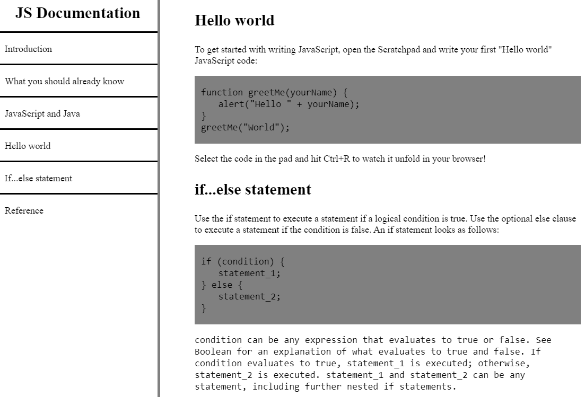

# Technical Documentation 
A responsive web technical documentation page built using CSS and HTML. The navigation bar to the left is constantly visible in a fixed position. The navigation bar also contains a list of clickable technical documentation headers that navigate the page to the applicable section of the web page.

Page and code can be easily accessed <a href="https://codepen.io/FishTacos/pen/gqyKxG">here</a>.

  
  Screenshot of a portion of the document page.

